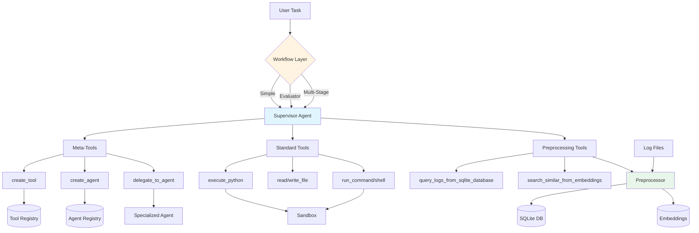

# Supervisor - AI Agent Framework

## What This Is

A self-modifying agentic system where a Supervisor agent orchestrates complex tasks by dynamically creating tools and specialized agents at runtime.

**Core concept**: The Supervisor can extend its own capabilities through meta-tools (`create_tool`, `create_agent`, `delegate_to_agent`), distinguishing it from standard task execution frameworks.

**INTEND Project Context**: Developed for intent-based management of computing systems, transitioning from instruction-based to intent-based management. Current focus is log analysis with agentic AI, studying different configurations and multi-agent workflows.

## Architecture

### Core Components

**Supervisor** ([core/supervisor.py](core/supervisor.py))
- Central orchestrator with three tool categories:
  - Meta-tools: Create tools/agents, delegate tasks
  - Standard tools: File I/O, code execution, shell commands  
  - Preprocessing tools: SQL queries, semantic search (when enabled)

**Agent** ([core/agent.py](core/agent.py))
- Minimal LLM wrapper: system prompt + tools
- Iterates until task complete or max iterations reached

**Registries** ([registry/](registry/))
- `ToolRegistry`: Dynamically created tools, persists to `workspace/tools/`
- `AgentRegistry`: Created agents, persists to `workspace/agents/`
- Standard agents ([core/standard_agents.py](core/standard_agents.py)): Pre-configured agents auto-registered on init

**Sandbox** ([core/sandbox.py](core/sandbox.py))
- Safe execution environment with timeout
- Whitelisted Unix commands
- Workspace isolation at `workspace/data/`

**Workflows** ([workflows/](workflows/))
- `SimpleWorkflow`: Direct passthrough
- `EvaluatorWorkflow`: Self-evaluation with retry loop  
- `MultiStageWorkflow`: Sequential stages with context accumulation

### Data Flow
```
User Task → Workflow → Supervisor → Agent(s) → Tools → Results
                ↓                      ↓
            Preprocessing        Dynamic Creation
```

### System Diagram



## Running the System

**Note**: This project uses `uv` for Python execution and package management.
```bash
# Interactive mode (default: SimpleWorkflow)
uv run python3 main.py

# With preprocessing (SQLite + optional embeddings)
uv run python3 main.py --preprocess workspace/data/logs.log --embeddings

# Specific workflow
uv run python3 main.py --workflow evaluator --max-iterations 3 "Task description"
uv run python3 main.py --workflow multi_stage --stages "Stage 1" "Stage 2" "Stage 3" "Task"
```

## Evaluation Framework

Located in [eval/](eval/), for systematic testing of log analysis tasks:
```bash
# Run experiments with multiple configurations
uv run python3 eval/eval_experiment.py --log data.log --ground-truth gt.json --experiments experiments.json --output results.csv

# Analyze results
uv run python3 eval/analyze_results.py results.csv
```

Structure: `ExperimentConfig` defines provider/model/workflow, `ExperimentRunner` executes and collects metrics.

## API Server

FastAPI server for multi-session task execution ([api/server.py](api/server.py)):
```bash
uv run uvicorn api.server:app --host 0.0.0.0 --port 8000
# Or: uv run python3 -m api.server
```

Key endpoints: `/sessions`, `/sessions/{id}/tasks`, `/jobs/{job_id}/status`

## Key Patterns

### Creating Tools Dynamically

Tools created via `create_tool` meta-tool persist to `workspace/tools/`:
```python
def parse_openstack_log(log_line: str) -> dict:
    """Parse OpenStack log line into structured data."""
    import re
    pattern = r'(?P<timestamp>\d{4}-\d{2}-\d{2}\s+\d{2}:\d{2}:\d{2}\.\d+)\s+(?P<level>\w+)'
    match = re.match(pattern, log_line)
    return match.groupdict() if match else {}
```

Best practice: Test with `execute_python` first, then register.

### Creating Specialized Agents

Agents spawned for focused subtasks with specific tool subsets:
```python
{
  "name": "log_analyzer",
  "system_prompt": "You analyze log patterns...",
  "tools": ["query_logs_from_sqlite_database", "write_file"]
}
```

Persist to `workspace/agents/{name}.json`.

### Preprocessing System

For large log files ([core/preprocessor.py](core/preprocessor.py)):

**SQLiteLogIngestion**: Parses logs into indexed database
```sql
CREATE TABLE logs (timestamp, level, component, message, line_number, raw_line)
```

**EmbeddingRAG**: Semantic search over log chunks (requires `sentence-transformers`)

**Available tools after preprocessing**:
```python
query_logs_from_sqlite_database(sql="SELECT * FROM logs WHERE level = ?", params=["ERROR"])
get_error_logs_from_sqlite_database(limit=100)
search_logs_from_sqlite_database(keyword="timeout", limit=50)
get_log_stats_from_sqlite_database()
search_similar_from_embeddings(query="connection failures", top_k=5)
```

## Configuration

All config in [config.toml](config.toml):
```toml
provider = "anthropic"  # or "openai", "ollama"
model = "claude-sonnet-4-20250514"
workspace = "./workspace"
tools_available = []  # Empty = all tools
tools_unavailable = ["execute_python"]  # Disable specific
agents_available = []  # Empty = all standard agents
agents_unavailable = []  # Exclude specific

log_full_messages = true  # Include complete LLM conversations
sandbox_timeout = 60  # Seconds
tool_call_output_max_length = 1000  # Characters
```

Access via `core.config.config.get("key")`.

### Standard Agents

Pre-configured agents auto-register on Supervisor init:
- **General**: `file_manager`, `shell_worker`, `log_analyst`
- **Log parsing pipeline**: `log_parser` → `log_template_critic` → `log_template_refiner`
- **Anomaly detection pipeline**: `log_preprocessor` → `log_anomaly_detector` → `anomaly_critic`

**Multi-agent delegation example**:
```python
supervisor.run("""
1. Use log_parser to extract template from the log line
2. Use log_template_critic to validate
3. Use log_template_refiner to produce final template
""")
```

## Critical Conventions

1. **Tool schemas use OpenAI/Anthropic function calling format**:
```python
   {"type": "function", "function": {"name": "...", "description": "...", "parameters": {...}}}
```

2. **Sandbox working directory**: `workspace/data/` - all file paths relative unless absolute

3. **Tools return dicts**: `{"success": True/False, "message": "...", ...}`

4. **Agent system prompts**: Loaded from `instructions/` directory (markdown files)

5. **Workflow names**: Lowercase in main.py - `"simple"`, `"evaluator"`, `"multi_stage"`

6. **LLM calls**: Through `LLMClient` ([core/llm_client.py](core/llm_client.py)) - abstracts provider differences

7. **Logging**: All runs to `logs/{timestamp}.json` with full message history ([core/logger.py](core/logger.py))

8. **Terminal output**: `PrintManager` ([core/printer.py](core/printer.py)) controls verbosity separately from logging

## Package Management

Uses **uv** for fast Python package management:
```bash
uv add package-name              # Add dependency
uv add --dev pytest              # Add dev dependency  
uv run python3 script.py         # Run scripts
uv run pytest tests/             # Run tests
```

Always use `uv run python3` instead of bare `python`.

## Testing
```bash
uv run pytest tests/
uv run python3 tests/test_workspace.py  # Workspace setup
uv run python3 tests/test_workflows.py  # Workflows
```

Note: Evaluation framework ([eval/](eval/)) serves as main validation.

## Integration Points

- **LiteLLM**: Unified LLM API (supports 100+ models)
- **sentence-transformers**: Optional, for embeddings
- **FastAPI**: Optional API server
- **SQLite**: Built-in, for log preprocessing

## Common Issues

- Preprocessing tools only available after `--preprocess` flag
- Registry persistence: tools/agents recreated from JSON on restart
- Sandbox timeout defaults to 60s - adjust in config for long operations
- Tool output truncation controlled by `tool_call_output_max_length`

## Project Goals

Watch for implementations that conflict with:
- Intent-based system management (high-level user intents → actions)
- Explainability and transparency (full audit trails)
- Autonomous operation with human oversight
- Log analysis as current research focus

## Contributing

```bash
git clone <repository-url> && cd supervisor
pip install -r requirements.txt
uv run pytest tests/
```

**New Workflow**: Extend `Workflow` in `workflows/`, implement `run()`, add to `__init__.py`

**New Preprocessing Step**: Extend `PreprocessorStep`, implement `process()` and `get_tools()`

**New Standard Agent**: Add to `STANDARD_AGENT_SPECS` in `core/standard_agents.py`
