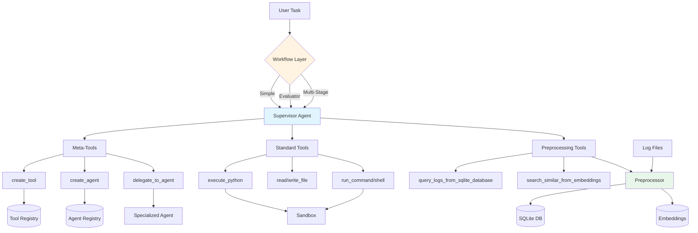

# Reference

Supplementary documentation for the Supervisor framework. See [PROJECT.md](../PROJECT.md) for architecture and usage.

## System Diagram



---

## Workflows

### Evaluator Workflow
Runs task → evaluates result → retries with feedback if not acceptable.

```bash
uv run python3 main.py --workflow evaluator --max-iterations 3 "Task"
```

Returns: `{content, evaluation_history, iterations_used}`

### Multi-Stage Workflow
Sequential stages with context accumulation. Each stage receives previous results.

```bash
uv run python3 main.py --workflow multi_stage --stages "Parse" "Analyze" "Report" "Task"
```

Returns: `{content, stage_results, stages_completed}`

### Predefined Workflows
- `analysis` - parse → analyze → summarize
- `research` - gather → synthesize → conclude  
- `transformation` - extract → transform → format

---

## Preprocessing Tools

Available after `--preprocess` flag. See PROJECT.md for setup.

### SQL Tools
```python
# Custom query
query_logs_from_sqlite_database(
    sql="SELECT * FROM logs WHERE level = ? LIMIT 10",
    params=["ERROR"]
)

# Shortcuts
get_error_logs_from_sqlite_database(limit=100)
search_logs_from_sqlite_database(keyword="timeout", limit=50)
get_log_stats_from_sqlite_database()
```

**Schema**: `logs(id, timestamp, level, component, message, raw_line, file_source)`

### Embedding Tools
```python
search_similar_from_embeddings(query="connection failures", top_k=5)
get_chunk_by_index_from_embeddings(chunk_index=42)
find_similar_to_chunk_from_embeddings(chunk_index=42, top_k=5)
```

### Supported Log Formats
- **OpenStack**: `2017-05-16 00:00:00.008 25746 INFO nova.osapi...`
- **BGL**: `- 2005.06.03 R02-M1-N0-C:J12-U11 2005-06-03-15.42...`
- **Generic**: `2024-01-15 10:30:45 ERROR Connection failed`

---

## Standard Agents & Pipelines

### Available Agents

| Agent | Purpose | Tools |
|-------|---------|-------|
| `file_manager` | File operations | read/write/list_files |
| `shell_worker` | Unix commands | run_command, run_shell |
| `log_analyst` | Log queries (requires preprocessing) | SQL + embedding tools |
| `log_parser` | Extract templates from logs | read/write_file |
| `log_template_critic` | Validate templates | read/write_file |
| `log_template_refiner` | Refine templates | read/write_file |
| `log_anomaly_detector` | Detect anomalies | read_file, SQL tools |
| `anomaly_critic` | Validate anomaly decisions | read_file |

### Multi-Agent Pipelines

**Log Parsing Pipeline**:
```
log_parser → log_template_critic → log_template_refiner
```

**Anomaly Detection Pipeline**:
```
log_preprocessor → log_anomaly_detector → anomaly_critic
```

Example delegation:
```python
supervisor.run("""
1. Use log_parser to extract template from the log line
2. Use log_template_critic to validate
3. Use log_template_refiner to produce final template
""")
```

### Configuration
```toml
# config.toml
agents_available = []           # Empty = all agents
agents_unavailable = ["log_analyst"]  # Exclude specific
```

---

## Evaluation

### Quick Start
```bash
# Generate ground truth from logs
uv run python3 eval/eval_ground_truth.py logs/sample.log > gt.json

# Run experiments
uv run python3 eval/eval_experiment.py \
  --log logs/sample.log \
  --ground-truth gt.json \
  --output results.csv

# Analyze
uv run python3 eval/analyze_results.py results.csv
```

### Experiment Config
```json
[
  {
    "name": "baseline",
    "provider": "anthropic",
    "model": "claude-sonnet-4-20250514",
    "workflow": "simple",
    "use_preprocessing": false
  },
  {
    "name": "with_preprocessing",
    "provider": "anthropic",
    "model": "claude-sonnet-4-20250514",
    "workflow": "evaluator",
    "use_preprocessing": true,
    "max_iterations": 3
  }
]
```

### Results Analysis
```python
import pandas as pd
df = pd.read_csv('results.csv')
print(df.groupby('config_name')['correct'].mean() * 100)
```

---

## API Quick Reference

### Core Initialization
```python
from core.llm_client import LLMClient
from core.supervisor import Supervisor
from registry.tool_registry import ToolRegistry
from registry.agent_registry import AgentRegistry

supervisor = Supervisor(
    llm_client=LLMClient(provider="anthropic", model="claude-sonnet-4-20250514"),
    tool_registry=ToolRegistry(),
    agent_registry=AgentRegistry(),
    instructions_dir="instructions",
    preprocessor=None
)
result = supervisor.run("Task description")
```

### With Preprocessing
```python
from core.preprocessor import Preprocessor, SQLiteLogIngestion, EmbeddingRAG

preprocessor = Preprocessor()
preprocessor.add_step(SQLiteLogIngestion())
preprocessor.add_step(EmbeddingRAG(chunk_size=100))
preprocessor.process(Path("logs/app.log"))

supervisor = Supervisor(..., preprocessor=preprocessor)
```

### Custom Tool Registration
```python
def my_tool(x: int) -> int:
    return x * 2

schema = {
    "type": "function",
    "function": {
        "name": "my_tool",
        "description": "Doubles a number",
        "parameters": {
            "type": "object",
            "properties": {"x": {"type": "integer"}},
            "required": ["x"]
        }
    }
}
tool_registry.register("my_tool", my_tool, schema)
```

### Config Access
```python
from core.config import config
provider = config.get("provider")
workspace = config.get("workspace")
```

---

## Contributing

### Setup
```bash
git clone <repository-url>
cd supervisor
pip install -r requirements.txt
uv run pytest tests/
```

### Adding Features

**New Workflow**: Extend `Workflow` in `workflows/`, implement `run()`, add to `__init__.py`

**New Preprocessing Step**: Extend `PreprocessorStep`, implement `process()` and `get_tools()`

**New Standard Agent**: Add to `STANDARD_AGENT_SPECS` in `core/standard_agents.py`

### Code Style
- Concise, minimal code
- Docstrings for public functions
- Follow existing patterns
