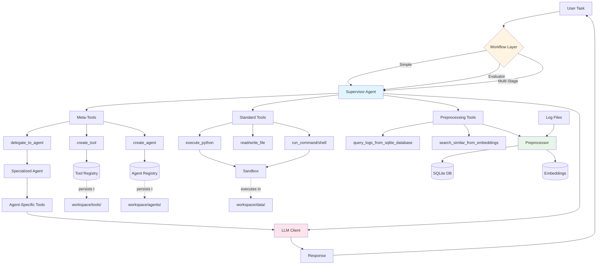

```mermaid
graph TB
    User[User Task] --> Workflow{Workflow Layer}
    
    Workflow -->|Simple| Supervisor[Supervisor Agent]
    Workflow -->|Evaluator| Supervisor
    Workflow -->|Multi-Stage| Supervisor
    
    Supervisor --> MetaTools[Meta-Tools]
    Supervisor --> StandardTools[Standard Tools]
    Supervisor --> PreprocTools[Preprocessing Tools]
    
    MetaTools --> CreateTool[create_tool]
    MetaTools --> CreateAgent[create_agent]
    MetaTools --> Delegate[delegate_to_agent]
    
    StandardTools --> ExecPython[execute_python]
    StandardTools --> FileOps[read/write_file]
    StandardTools --> UnixCmd[run_command/shell]
    
    PreprocTools --> SQL[query_logs_from_sqlite_database]
    PreprocTools --> Semantic[search_similar_from_embeddings]
    
    CreateTool --> ToolRegistry[(Tool Registry)]
    CreateAgent --> AgentRegistry[(Agent Registry)]
    
    Delegate --> SpecializedAgent[Specialized Agent]
    SpecializedAgent --> AgentTools[Agent-Specific Tools]
    AgentTools --> LLM[LLM Client]
    
    ExecPython --> Sandbox[Sandbox]
    UnixCmd --> Sandbox
    
    PreprocTools --> Preprocessor[Preprocessor]
    Preprocessor --> SQLite[(SQLite DB)]
    Preprocessor --> Embeddings[(Embeddings)]
    
    LogFile[Log Files] --> Preprocessor
    
    Supervisor --> LLM
    LLM --> Response[Response]
    Response --> User
    
    ToolRegistry -.persists to.-> Workspace[workspace/tools/]
    AgentRegistry -.persists to.-> Workspace2[workspace/agents/]
    Sandbox -.executes in.-> Workspace3[workspace/data/]
    
    style Supervisor fill:#e1f5ff
    style Workflow fill:#fff4e1
    style Preprocessor fill:#e8f5e9
    style LLM fill:#fce4ec
```